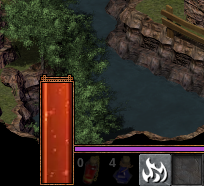

# Flare-Fantasy-UI
Fantasy UI Mod for Flare Rpg

# Install
- Copy the `fantasy-ui` folder into the mods folder of your Flare installation.
- In the main-menu, go to: Configuration -> Mods and enable the `fantasy-ui` mod.
- have fun :)